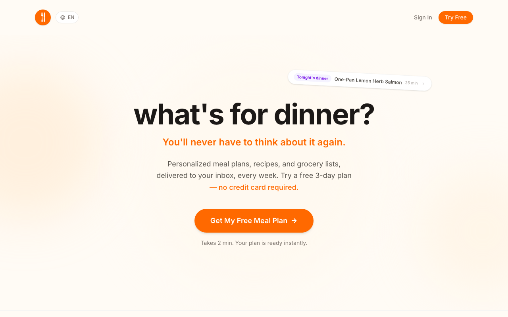
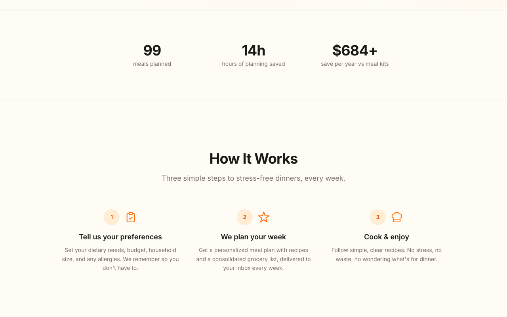
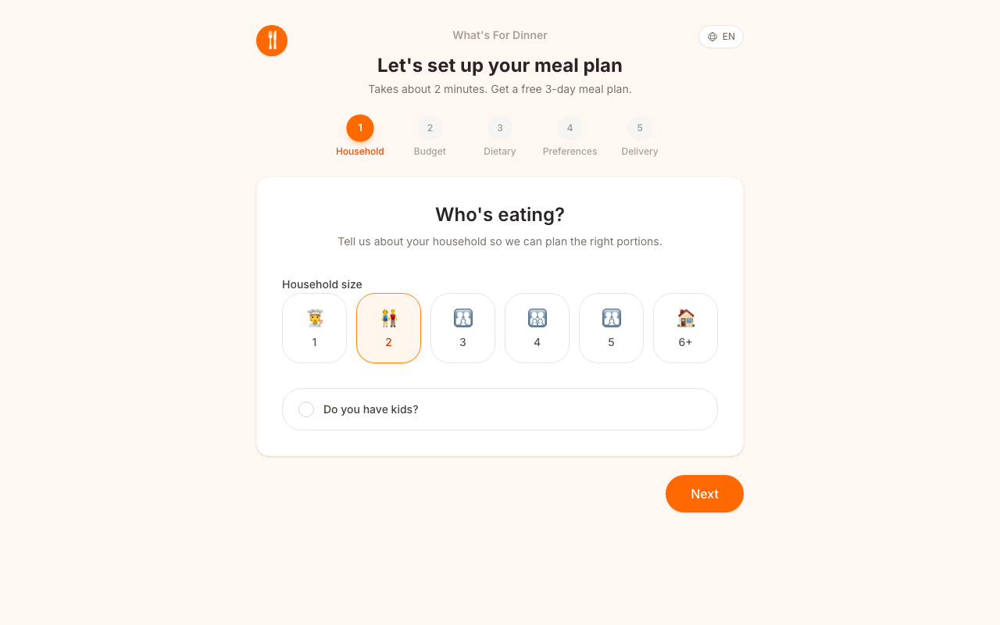
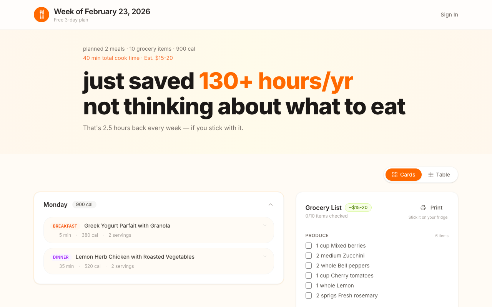
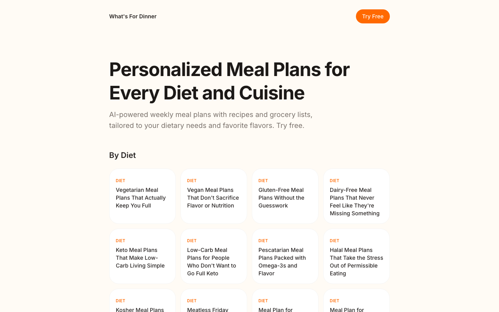
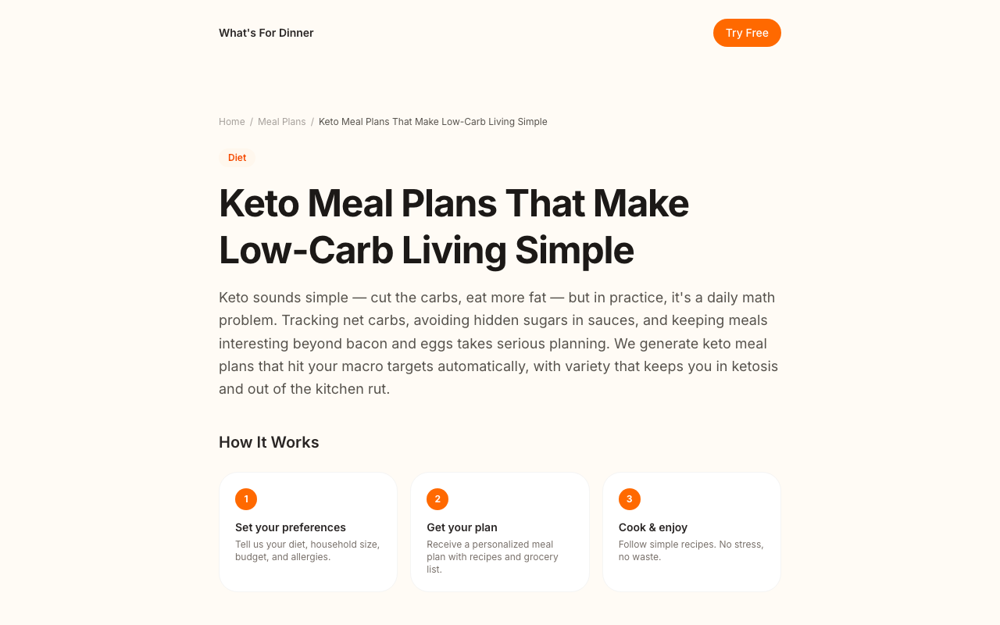
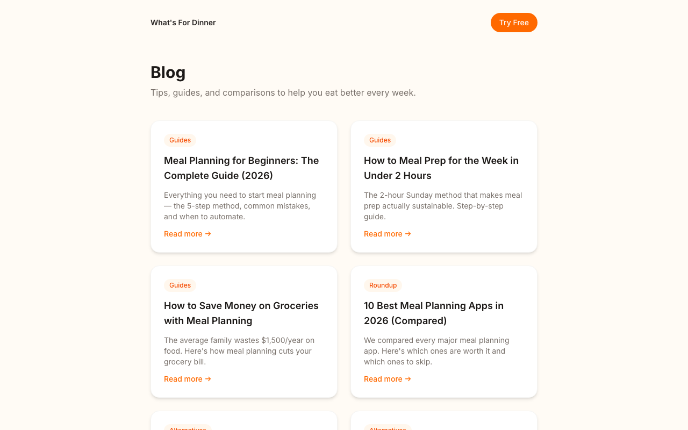
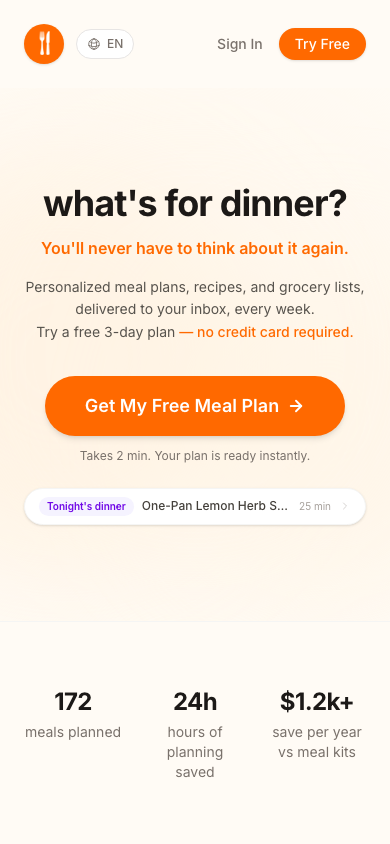
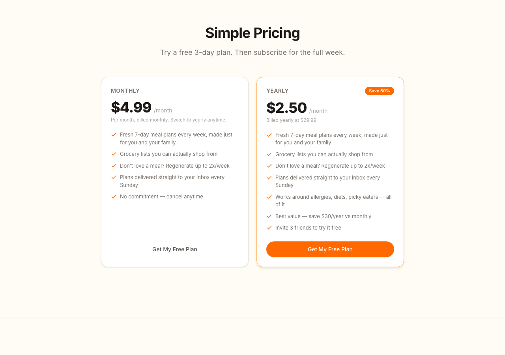
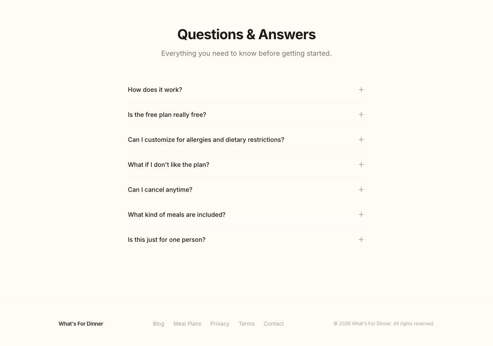

# What's For Dinner?

**Personalized meal plans, recipes, and grocery lists — delivered to your inbox every week.**

No more staring at the fridge. No more last-minute takeout. Just tell us what you like, and we handle the rest.

[whatsfordinner.fit](https://whatsfordinner.fit)



---

## How it works

1. **Tell us your preferences** — dietary needs, budget, household size, allergies, favorite cuisines
2. **AI plans your week** — personalized recipes + a consolidated grocery list, delivered by email every Sunday
3. **Cook and enjoy** — simple recipes, no waste, no stress



---

## Try it free

Get a free 3-day meal plan without creating an account. No credit card, no signup — just answer 5 quick questions.



---

## Here's what you get

Every plan includes recipes with ingredients, cook times, calorie counts, and a grocery list you can actually shop from.



Browse 80+ meal plan pages covering every diet, cuisine, and goal:





18 blog articles with guides, comparisons, and competitor alternatives:



Works on mobile too:



---

## Pricing

- **$4.99/month** — fresh 7-day plans every week
- **$2.50/month** — billed yearly at $29.99

Both plans include a free 3-day trial, regeneration (up to 2x/week), and support for allergies, diets, and picky eaters.



---

## Questions & Answers

7 FAQs covering how it works, customization, cancellation, and more.



---

## 140 SEO pages

Programmatic SEO covering every meal planning search query:

- **10 diet pages** — vegetarian, vegan, keto, gluten-free, halal, and more
- **12 cuisine pages** — Italian, Thai, Indian, Mexican, Mediterranean, and more
- **20 diet + cuisine combos** — vegan Thai, keto Mediterranean, halal Indian, etc.
- **10 goal pages** — weight loss, muscle gain, budget, pregnancy, diabetes
- **6 household pages** — for one, for two, family of 4, college students
- **6 calorie pages** — 1200 to 3000 calories
- **6 duration pages** — 3-day to 30-day plans
- **10 seasonal + combo pages** — summer, winter, holiday, diet+goal combos
- **18 blog articles** — competitor alternatives, how-to guides, roundups

All pages include JSON-LD schema, OG images, canonical URLs, and internal cross-links.

Browse them at [whatsfordinner.fit/meal-plans](https://whatsfordinner.fit/meal-plans)

---

## Tech stack

| Layer | Tech |
|-------|------|
| Frontend | Next.js 16 (App Router), React 19, TypeScript, Tailwind 4 |
| Auth | Supabase Auth (email + Google OAuth) |
| Database | Supabase (Postgres + RLS) |
| AI | Claude API (meal plan generation) |
| Payments | Lemon Squeezy (subscriptions) |
| Email | Resend (weekly delivery + auth SMTP) |
| Hosting | Vercel (cron for weekly batch) |
| i18n | 11 languages (EN, ES, FR, DE, PT, JA, KO, ZH, AR, HI, TR) |

## Project structure

```
src/
  app/
    page.tsx                    # Landing page
    dashboard/                  # Subscriber dashboard
    onboarding/                 # 5-step preference setup
    preview/                    # Free plan viewer
    plan/[weekId]/              # Full meal plan view
    blog/                       # 18 SEO articles
    meal-plans/                 # Hub + 80 pSEO pages
    not-found.tsx               # Custom 404
    sitemap.ts                  # 140 URLs
    robots.ts                   # Crawl rules
    api/
      generate-plan/            # Authenticated plan generation
      generate-free-plan/       # Free 3-day plan (rate limited)
      lemonsqueezy/             # Checkout, webhook, portal
      cron/weekly/              # Sunday batch: generate + email all subscribers
      send-plan/                # Email delivery
      profile/                  # User preferences CRUD
      promo/                    # Promo code redemption
  data/
    meal-plans/                 # pSEO data maps (diets, cuisines, combos, etc.)
  lib/
    anthropic.ts                # Claude API + prompt builder
    resend.ts                   # Email templates
    supabase/                   # Client, server, admin clients
    lemonsqueezy.ts             # Payment setup + config
    og-blog.tsx                 # Shared OG image generator
    i18n/                       # 11 language translations
  components/
    landing/                    # Hero, HowItWorks, Pricing, FAQ, Footer
    onboarding/                 # Step components
    dashboard/                  # Dashboard widgets + referral codes
    plan/                       # Meal cards, grocery list
    meal-plans/                 # MealPlanTemplate (pSEO)
    seo/                        # ArticleJsonLd, BreadcrumbJsonLd
    ui/                         # Button, Card, Input, Toast, etc.
```

## Running locally

```bash
# Install
npm install

# Set up environment variables (see .env.example)
cp .env.example .env.local

# Run dev server
npm run dev
```

Required env vars:
- `NEXT_PUBLIC_SUPABASE_URL` + `NEXT_PUBLIC_SUPABASE_ANON_KEY` — Supabase project
- `SUPABASE_SERVICE_ROLE_KEY` — Server-side DB access
- `ANTHROPIC_API_KEY` — Claude API for meal plan generation
- `LEMONSQUEEZY_API_KEY` + `LEMONSQUEEZY_STORE_ID` + variant IDs — Payments
- `LEMONSQUEEZY_WEBHOOK_SECRET` — Webhook verification
- `RESEND_API_KEY` — Email delivery
- `CRON_SECRET` — Protects the weekly cron endpoint

---

Built by [Zen](https://github.com/rizzytoday)
